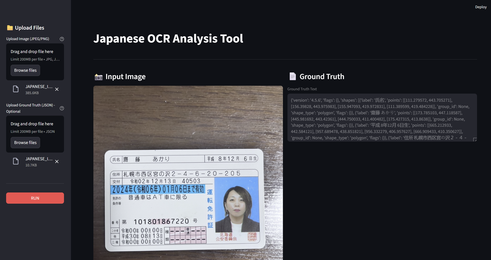
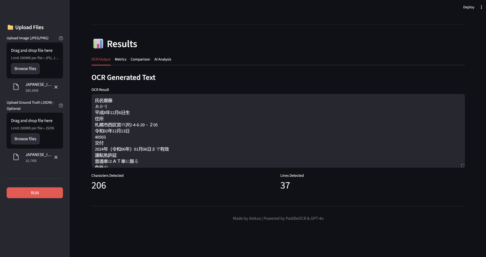
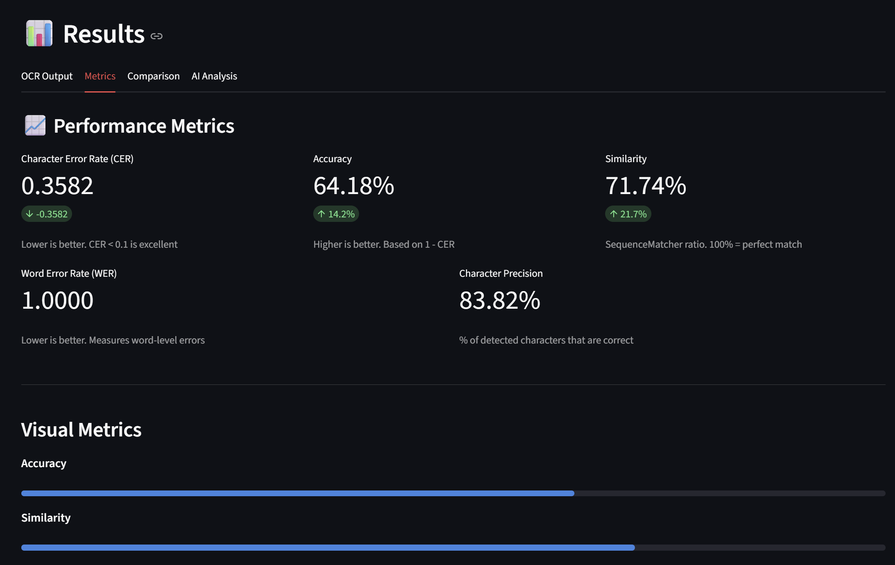
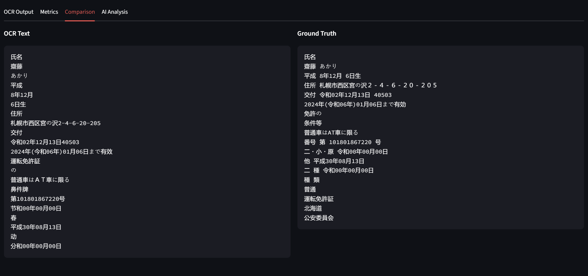
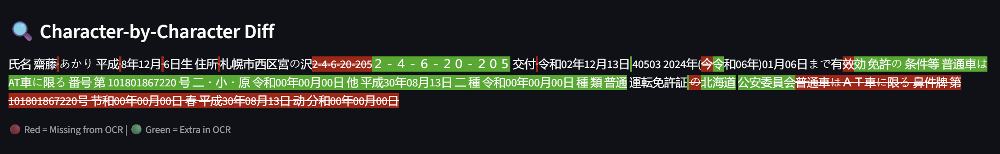

# Japanese OCR Error Analysis Tool

This project is a pipeline for **Japanese text OCR evaluation and error analysis**.

## Overview

The system combines:

- **PaddleOCR** for performing OCR on Japanese text images
- A **GPT-4o–based AI agent** for detailed, line-by-line analysis of OCR errors

The goal is not only to extract text, but to **understand where and why OCR errors occur**.

## OCR Pipeline

- OCR is performed using **PaddleOCR**
- The pipeline supports Japanese writing systems (kanji, hiragana, katakana)
- OCR results can be evaluated using standard metrics (e.g. CER)
- The OCR component runs in an isolated environment due to dependency constraints

## AI Error Analysis

- A **GPT-4o agent** compares the OCR output with ground-truth text
- The agent provides:
  - Line-by-line comparison
  - Identification of incorrect segments
  - Classification of error types (wrong kanji, missing characters, kana confusion, etc.)
  - Explanations of likely OCR failure causes (visual similarity, segmentation issues, font effects)

## Architecture

- **Streamlit** is used as the frontend for image upload, ground-truth input, and result visualization
- **FastAPI** is used to reliably connect components running in separate Python environments
- OCR and AI analysis run in **isolated environments** to avoid dependency conflicts
- Components communicate via HTTP services for stability and reproducibility

## Purpose

This tool is designed for:

- OCR quality evaluation
- Dataset validation
- Error forensics in Japanese document OCR
- Research and development workflows

---

## How It Works

The Japanese OCR Analysis Tool provides a comprehensive interface for analyzing OCR accuracy on Japanese documents. Here's a walkthrough of the main features:

### 1. Upload and Input

The application features a clean, intuitive interface where you can:
- Upload your Japanese document image (JPEG/PNG, max 200MB)
- Optionally upload ground truth data in JSON format for accuracy comparison
- Process the image with a single click using the "RUN" button

### 2. OCR Results

After processing, the application displays:
- **OCR Generated Text**: The extracted Japanese text from your document
- **Characters Detected**: Total number of characters recognized (e.g., 206)
- **Lines Detected**: Number of text lines identified (e.g., 37)

The OCR output preserves the original text structure and formatting.

### 3. Performance Metrics

The tool provides detailed performance analytics:

**Performance Metrics:**
- **Character Error Rate (CER)**: Measures character-level accuracy (lower is better, <0.1 is excellent)
- **Word Error Rate (WER)**: Evaluates word-level errors
- **Accuracy**: Overall correctness percentage (higher is better, based on 1 - CER)
- **Similarity**: SequenceMatcher ratio showing text similarity (100% = perfect match)
- **Character Precision**: Percentage of detected characters that are correct

**Visual Metrics:**
- Interactive bar charts for Accuracy and Similarity percentages
- Green indicators showing improvement trends

### 4. Side-by-Side Comparison

Compare OCR results against ground truth:
- **OCR Text** (left): The extracted text from the image
- **Ground Truth** (right): The reference text for comparison
- Easy visual comparison to identify discrepancies

### 5. Character-by-Character Analysis

Detailed character-level difference highlighting:
- **Red text**: Characters missing from OCR output
- **Green text**: Extra characters in OCR output
- Inline visualization makes it easy to spot specific errors
- Perfect for fine-tuning and debugging OCR accuracy

All results are powered by PaddleOCR and GPT-4o for accurate Japanese text recognition and analysis.

It is recommended to run the **agent service** and the **OCR service** in separate Python environments, as they have different and often conflicting dependencies, which helps avoid instability and dependency hell.
